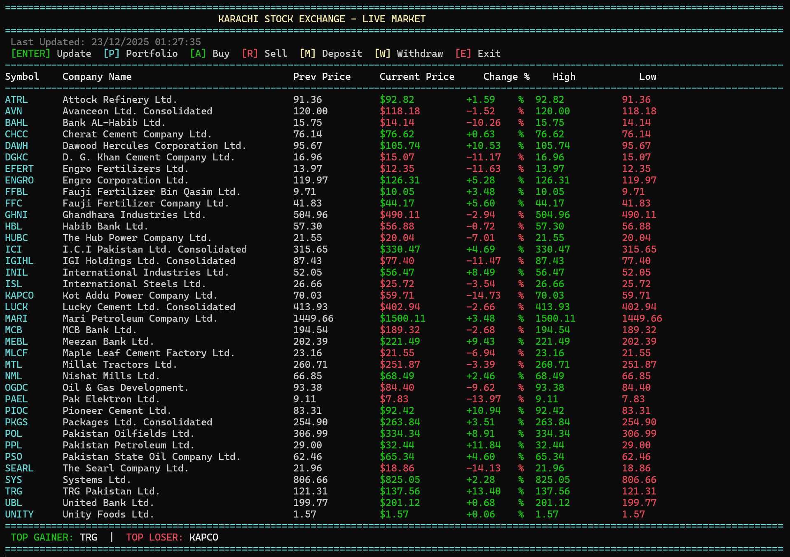
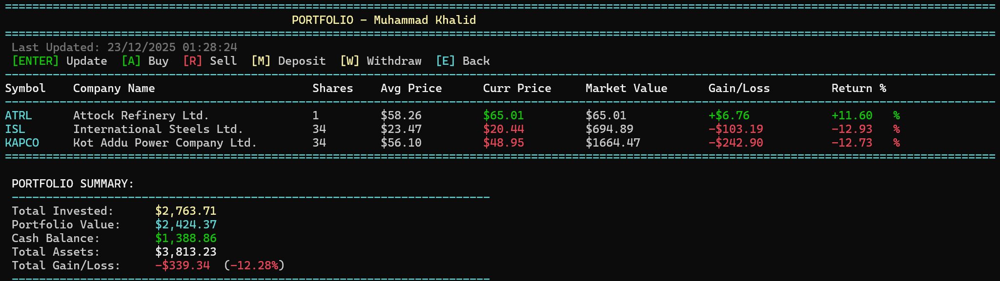

# Stock Market Simulation and Portfolio Management

## Project Overview

This is an enhanced C++ application that simulates a live stock market environment with a professional portfolio management system. The application provides real-time stock price fluctuations, comprehensive portfolio tracking, and persistent data storage across sessions.

## Features

### Core Features
- **Real-time Stock Price Updates**: Prices fluctuate randomly within ±15% per update cycle
- **Portfolio Management**: Buy and sell stocks with detailed transaction information
- **Data Persistence**: All data is automatically saved and restored between sessions
- **Input Validation**: Comprehensive validation prevents invalid transactions and user errors
- **Professional UI**: Clean, organized console interface with clear navigation
- **Cross-Platform Support**: Windows-optimized with cross-platform compatibility

### Enhanced Features
- **Partial Stock Sales**: Sell a portion of your holdings or all at once
- **Portfolio Analytics**: Track gains/losses, portfolio value, and total assets
- **High/Low Tracking**: Monitor price ranges throughout the session
- **Top Performers**: Identify best advancing and declining stocks
- **Cash Management**: Deposit and withdraw funds with validation
- **Error Handling**: Robust error checking for all file operations

## System Requirements

- **Operating System**: Windows 10/11 (or Linux/macOS with minor modifications)
- **Compiler**: C++11 compatible compiler (g++, MinGW, MSVC)
- **RAM**: 256 MB minimum
- **Disk Space**: 10 MB

## File Structure

```
Stock-Market-Simulation/
│
├── code.cpp              # Main application source code
├── companies.txt         # Stock data (Symbol, Company Name, Price)
├── portfolio.txt         # User portfolio (auto-generated/updated)
└── README.md            # This file
```

## Installation & Setup

### Method 1: Using g++ (MinGW on Windows)

1. **Install MinGW**: Download from [mingw-w64.org](https://www.mingw-w64.org/)

2. **Open Command Prompt** in the project directory

3. **Compile the program**:
   ```cmd
   g++ -std=c++11 code.cpp -o StockMarket.exe
   ```

4. **Run the program**:
   ```cmd
   StockMarket.exe
   ```

### Method 2: Using Visual Studio

1. Open Visual Studio
2. Create a new C++ Console Application project
3. Replace the default code with `code.cpp`
4. Copy `companies.txt` to the project directory
5. Build and run (Ctrl+F5)

### Method 3: Using VS Code

1. Install the C/C++ extension
2. Open the project folder in VS Code
3. Configure tasks.json for build
4. Press F5 to compile and run

## Screenshots

### Main Stock Market Screen


### Portfolio View


## How to Use

### First Time Setup

1. **Launch the application** - The program will automatically detect that no portfolio exists
2. **Enter your name** when prompted
3. **Enter initial balance** (e.g., 10000)
4. The main stock market screen will appear

### Main Stock Market Screen

**Available Commands:**
- `Enter` - Update stock prices (refresh market data)
- `P` - View your portfolio
- `A` - Add (buy) a stock
- `R` - Remove (sell) a stock
- `M` - Add money to your account
- `W` - Withdraw money from your account
- `E` - Exit the application

### Buying Stocks

1. Press `A` from the main screen
2. Enter the stock symbol (e.g., `OGDC`)
3. Enter the number of shares to purchase
4. Confirm the transaction
5. Your balance will be updated automatically

### Selling Stocks

1. Press `R` from the main screen (or portfolio view)
2. Enter the stock symbol to sell
3. Choose how many shares to sell (0 for all)
4. Receive cash immediately at current market price

### Portfolio View

Press `P` to view detailed portfolio information:
- All owned stocks with share counts
- Current and previous prices
- Individual stock gains/losses
- Portfolio value and total assets
- High/low prices for the session

**Portfolio Commands:**
- `Enter` - Update prices
- `A` - Buy more stocks
- `R` - Sell stocks
- `M` - Deposit money
- `W` - Withdraw money
- `E` - Return to main market view

## Stock Data Format

The `companies.txt` file should follow this CSV format:

```csv
Symbol,Company Name,Stock Price
OGDC,Oil & Gas Development.,74.39
HBL,Habib Bank Ltd.,68.29
```

**Important Notes:**
- Do not edit the file while the program is running
- Keep a backup of the original file
- The program updates prices but maintains the format

## Portfolio Data

The `portfolio.txt` file is automatically managed:
- Created on first run
- Updated after every transaction
- Saved automatically on exit
- Contains your complete portfolio state

**⚠️ Important**: The program now automatically manages `portfolio.txt`. You no longer need to delete it before running - it will load your existing portfolio or create a new one if needed.

## Troubleshooting

### Program won't start
- Ensure `companies.txt` exists in the same directory as the executable
- Check that the file is properly formatted (CSV with header)
- Verify you have read/write permissions in the directory

### "Failed to open file" error
- Run the program from the correct directory
- Check file permissions
- Ensure no other program has the files open

### Prices show as 0 or incorrect values
- Verify `companies.txt` has valid numeric prices
- Check for missing commas in the CSV format
- Ensure no extra spaces in the data

### Portfolio not loading
- Check `portfolio.txt` format hasn't been manually corrupted
- If needed, delete `portfolio.txt` to create a fresh portfolio
- Ensure the file isn't set to read-only

### Compilation errors on Windows
- Install a C++11 compatible compiler (MinGW or Visual Studio)
- Add compiler to system PATH
- Use `g++ -std=c++11` flag for proper C++11 support

## Technologies Used

- **C++11**
  - Arrays, loops, functions, strings, random number generation
  - File handling (read/write)
  - Data structures (2D arrays for stock data, parallel arrays for portfolios)
  - Input validation and error handling
  - Cross-platform compatibility features

## Technical Details

### Key Improvements Over Original

1. **Windows Compatibility**
   - Replaced ANSI color codes with ASCII indicators (^ and v)
   - Cross-platform character input handling
   - Clear screen functionality optimized for Windows

2. **Enhanced Error Handling**
   - Input validation for all user entries
   - File operation error checking
   - Graceful handling of edge cases

3. **Better Code Structure**
   - Modular function design
   - Improved variable naming
   - Consistent code formatting
   - Switch-case for better control flow

4. **Improved Features**
   - Partial stock selling
   - Portfolio value calculation
   - Total assets tracking
   - Better file parsing for portfolio loading
   - Uppercase stock symbol conversion

5. **User Experience**
   - Clear screen between views
   - Confirmation messages
   - Better formatted output
   - Helpful error messages
   - "Press any key to continue" prompts

## Tips for Best Experience

1. **Start with realistic balance**: $10,000 - $50,000 recommended
2. **Monitor market regularly**: Press Enter to update prices
3. **Diversify portfolio**: Don't invest everything in one stock
4. **Track your performance**: Check portfolio view frequently
5. **Save before exiting**: Always use 'E' to exit properly

## Development Notes

- **Language**: C++11
- **Paradigm**: Procedural programming
- **Platform**: Windows (primary), Linux/macOS (compatible)
- **IDE**: VS Code, Visual Studio, Code::Blocks, or any C++ IDE

## Future Enhancements (Potential)

- Stock search functionality
- Transaction history log
- Multiple portfolio support
- Advanced analytics and charts
- Network-based real market data
- Database integration

## License

This is an educational project. Feel free to use and modify for learning purposes.

## Author

Created as a programming project to demonstrate C++ file handling, data structures, and console UI design.

---

**Version**: 2.0 (Enhanced & Windows-Optimized)  
**Last Updated**: December 2024

For issues or questions, refer to the troubleshooting section above.

